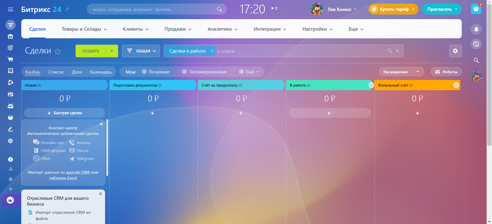
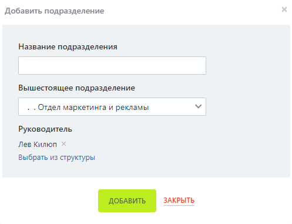
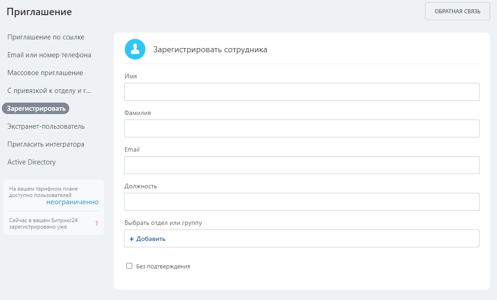
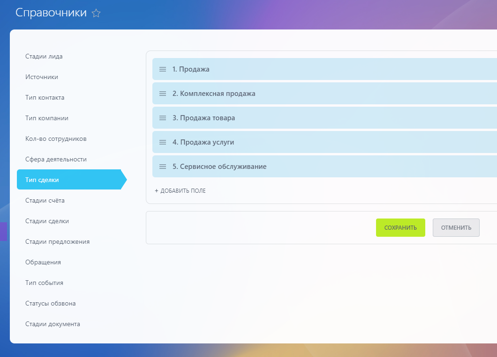

# Практическая работа №3

## Справочная информация

### Регистрация

Для доступа к Битрикс24 необходимо зарегистрировать аккаунт по ссылке <https://www.bitrix24.ru/>  
необходимо получить доступ к следующей рабочей области:  

### Структура компании

Для настройки структуры компании выберите пункт "Компания" в боковом меню.  
У вас уже будет настроено три подразделения главного отдела компании.  
У вас есть возможность добавлять новые подразделения.  
Для создания нового отдела нажмите "добавить подразделение". Вы сможете указать название, вышестоящее подразделение и руководителя.  

### Создание сотрудников

Для добавления сотрудников находясь на вкладке "Компания" нажмите кнопку "Пригласить сотрудников".  
Вы можете пригласить пользователя по ссылке, либо зарегистрировать его самостоятельно.

### Справочники

Справочники представляют собой набор значений различных полей системы (стадии лида, тип сделки и т.п.).  
Вы можете задать свои значения нажав в верхнем меню "Настройки" > "Настройки CRM" и выбрав "Справочники"

### Товары и услуги

Вы можете перейти в меню товаров выбрав в верхнем меню "Товары и склады" > "Каталог товаров".  
Товары и услуги могут быть сгруппированы по разделам или храниться в общей папке.  
По товарам и услугам доступен поиск с различными фильтрами.  
В каталоге можно выбрать поля для отображения.  
Вы можете добавлять разделы, товары и услуги в соответствующем меню.  

## Задание

Настройка CRM должна соответствовать тематике вашего варианта.  
Каждый пункт должен сопровождаться скриншотом.  

1. Зарегистрируйтесь и получите доступ к Битрикс24.
1. Настройте структуру компании. Дерево, описывающее структуру, должно быть размером не меньше 12, высотой не меньше 3.
1. Заполните каждое подразделение как минимум 1 сотрудником.  
1. Добавьте как минимум по 3 поля в справочники "Тип сделки", "Обращения", "Тип события"
1. Создайте как минимум 2 категории товаров и услуг, в каждую из которых добавьте не меньше трёх товаров или услуг.  

### Варианты

|Номер в журнале|Компания|Номер в журнале|Компания|
|-|-|-|-|
|1|Авиакомпания|16|Кофейня|
|2|Автосалон|17|Медицинская клиника|
|3|Автошкола|18|Музей|
|4|Агенство недвижимости|19|Музыкальная студия|
|5|Антикварный магазин|20|Прокат спортивного снаряжения|
|6|Архитектурное бюро|21|Рекламное агенство|
|7|Ателье|22|Ресторан
|8|Банк|23|Спортивный клуб|
|9|Библиотека|24|Театр|
|10|Детский сад|25|Телекомпания|
|11|Интернет-провайдер|26|Туристическое агенство|
|12|Кинотеатр|27|Ферма|
|13|Книжное издательство|28|Фитнес-студия|
|14|Компания грузоперевозок|29|Цветочный магазин|
|15|Компания по производству игрушек|30|Школа|
