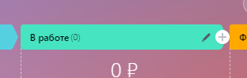
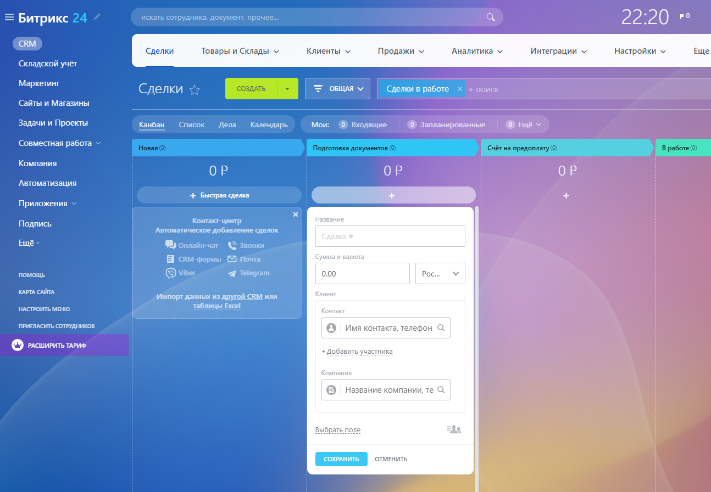
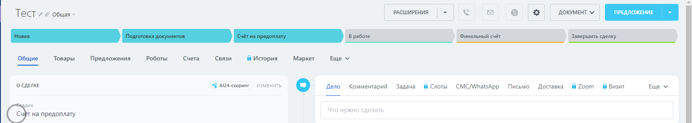
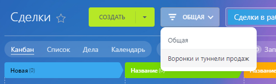
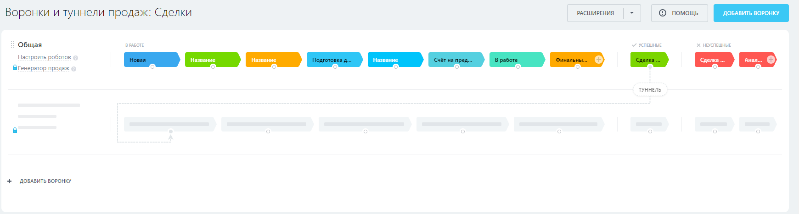
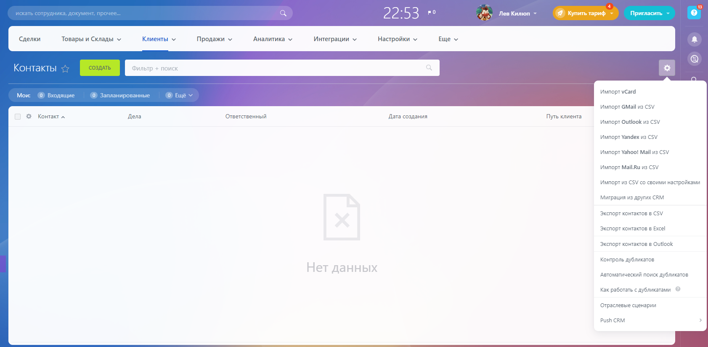
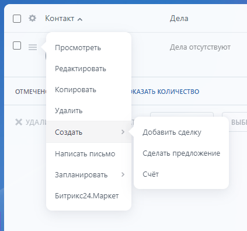

# Практическая работа №4

## Справочная информация

### Сделки

Сделка - это процесс продажи товара или услуги клиенту
Получить доступ к сделкам можно через меню CRM > Сделки

По умолчанию страница отображается в виде Канбан. Стадии можно изменять и добавлять новые, рядом с каждым этапом есть кнопка редактирования и добавления этапа слева. Так же этапы можно перетаскивать относительно друг друга.

Есть два способа создать сделку.  
Первый - быстрый через "плюсик" в любой из стадий в представлении Канбан. Тут можно будет заполнить название сделки, сумму с выбором валюты, клиента и настроить дополнительные поля по кнопке "Выбрать поле"

Второй способ через полноценное меню  
В нём так же будет доступен блок "О сделке", который мы видели в прошлом варианте.  
Кроме этого в блоке "Дополнительно" можно указать сведения об источнике, а так же выбрать ответственного и оставить комментарий.  
Ниже в блоке "Товары" можно выбрать товар или услугу, которую мы продаём клиенту, а ниже Данную сделку можно сделать регулярной.  

Карточку сделки можно настроить под любой вид деятельности: создавать новые поля, настраивать доступ и т.п.  

### Воронки продаж

Сверху у созданной сделки есть направление сделки (воронка продаж).  
Настройка воронки доступна в выпадающем меню "Общая"

### Контакты

У вас есть возможность сохранять контакты на соответствующей вкладке CRM > Клиенты > Контакты  
Контакты отображаются в виде списка, содержащий основную информацию, однако формат отображения можно изменить.  
Сбоку в выпадающем меню есть множество инструментов, например импорт, экспорт, контроль дубликатов и прочее  

Карточка клиента состоит из нескольких элементов, где можно сохранить детальную информацию о клиенте.  
На основе контакта можно, например, создать сделку (тогда клиент будет автоматически занесён в соответствующий блок)

## Компании

В этом же категории расположен список компаний (CRM > Клиенты > Компании).  
По аналогии он содержит основную информацию, формат отображения которой редактируется.  

Работа с компаниями во многом аналогична работе с клиентами.  

## Задание

На основе практической работы №3 продолжите настраивать Битрикс24 согласно своему варианту.  

1. Создайте не менее пяти контактов, укажите для них информацию, которая могла бы быть полезно относительно вашего варианта.  
1. По аналогии создайте не менее пяти компаний (клиентов), заполнив полезную информацию.
1. Создайте не менее десяти сделок, заполнив блоки "О сделке", "Дополнительно" и "Товары" (ссылаясь на товары из предыдущей практики).  Клиенты должны быть заполнены созданными в предыдущем пункте контактами и компаниями. Сделки должны подходить по тематике вашему варианту.  
1. Для одной из сделок пройдитесь по всем стадиям (в отчёт необходимо приложить скриншот истории изменений по сделке)

### Варианты

|Номер в журнале|Компания|Номер в журнале|Компания|
|-|-|-|-|
|1|Авиакомпания|16|Кофейня|
|2|Автосалон|17|Медицинская клиника|
|3|Автошкола|18|Музей|
|4|Агенство недвижимости|19|Музыкальная студия|
|5|Антикварный магазин|20|Прокат спортивного снаряжения|
|6|Архитектурное бюро|21|Рекламное агенство|
|7|Ателье|22|Ресторан
|8|Банк|23|Спортивный клуб|
|9|Библиотека|24|Театр|
|10|Детский сад|25|Телекомпания|
|11|Интернет-провайдер|26|Туристическое агенство|
|12|Кинотеатр|27|Ферма|
|13|Книжное издательство|28|Фитнес-студия|
|14|Компания грузоперевозок|29|Цветочный магазин|
|15|Компания по производству игрушек|30|Школа|
