# Практическая работа №4

## Справочная информация

### Товары

В Битрикс24 вы можете создавать товары и услуги. Не важно, продаёте вы шины или юридические консультации. Всё, что вы предлагаете клиенту, можно хранить в Каталоге товаров.

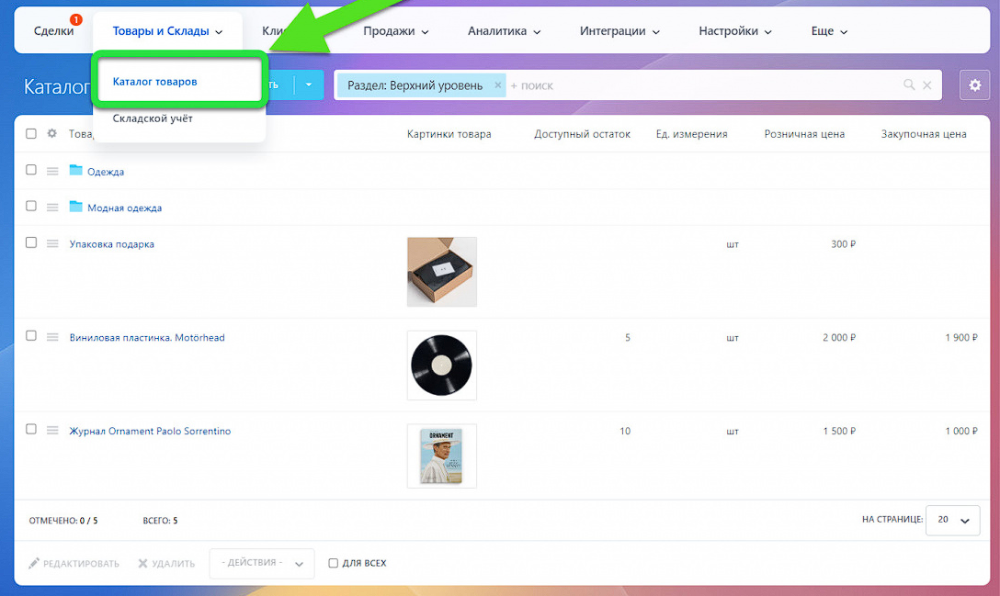

Товары и услуги можно хранить в общей папке или сгруппировать в разделы.

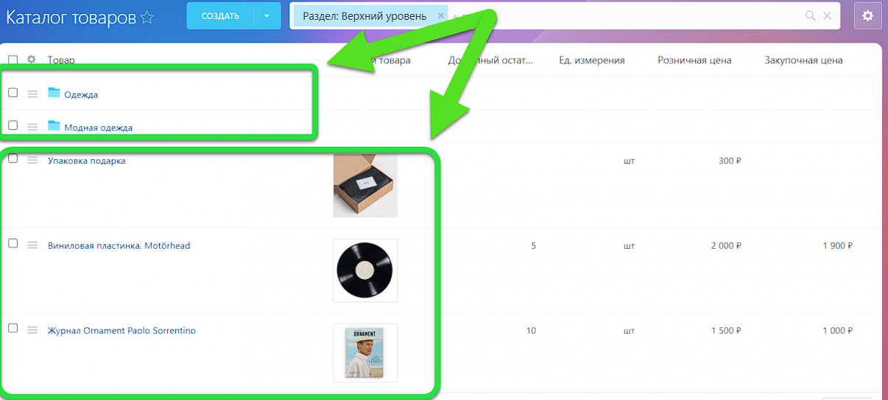

Найти товар или услугу можно через окно поиска. Укажите название в соответствующем поле.

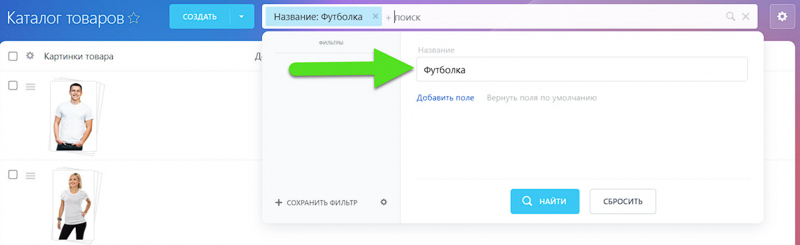

Услуги и товары можно редактировать в каталоге или внутри карточки.

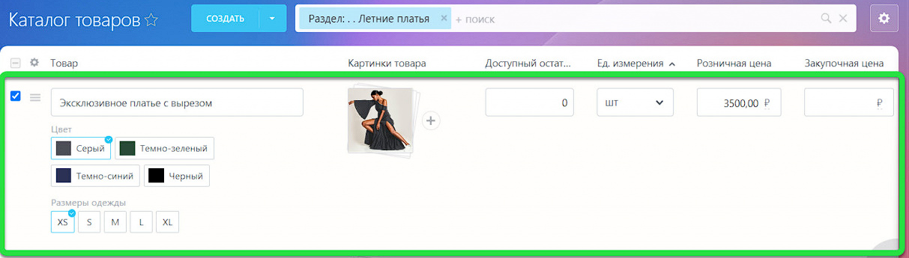

Каждый товар имеет одно или несколько свойств, которые его характеризуют. Как правило, эти свойства имеют значение для покупателей и пользователей товара, поэтому важно их показать. У продуктов мы хотим знать состав, у одежды — размер, а у книги — автора. Эта информация помогает сделать правильный выбор.

Свойства товара можно хранить в его карточке. В этом случае менеджер, который общается с клиентом по телефону, сможет быстро найти информацию, а посетитель интернет-магазина увидит всё на сайте.

Простые свойства - это характеристики, которые описывают товар.

> Для одежды это производитель или материал. Для мониторов - тип матрицы, диагональ или разрешение экрана.

Свойства вариаций - это свойства торговых предложений для одного и того же товара. Каждое значение таĸого свойства составляет отдельное торговое предложение.

> Примеры свойств вариаций: цвета или размеры одежды. Каждая комбинация подобных свойств создаёт отдельный товар, например, одна и та же футболка, но синяя размера XL или красная размера M.

#### Простые свойства в карточке товара

В карточке товара по умолчанию есть предустановленные свойства, которые можно отнести к простым: Название и Описание.

Чтобы заполнить значения этих полей, зайдите в карточку товара. И нажмите Изменить в разделе Характеристики.

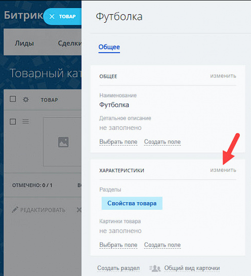

Для примера заполним поле Материал. Укажите 100% хлопок.

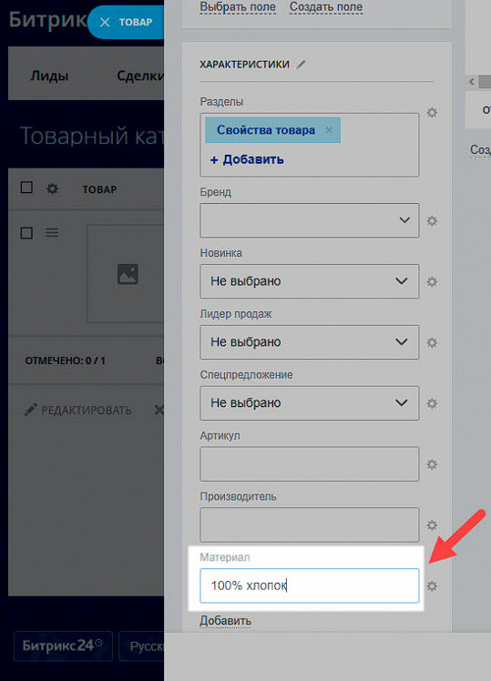

Простые свойства отображаются в левой части карточки товара, а также в списке.

#### Свойства вариаций в карточке товара

К свойствам вариации можно отнести размер и цвет.

Чтобы создать свойство размер зайдите в карточку товара, нажмите Создать свойство вариации и выберите Список.

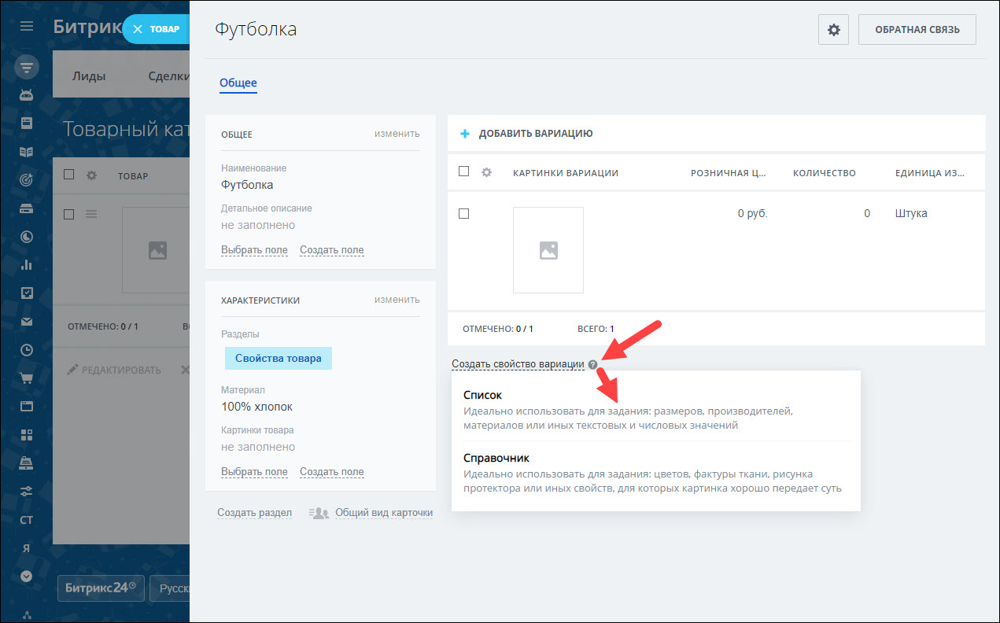

Укажите название поля и варианты размеров.

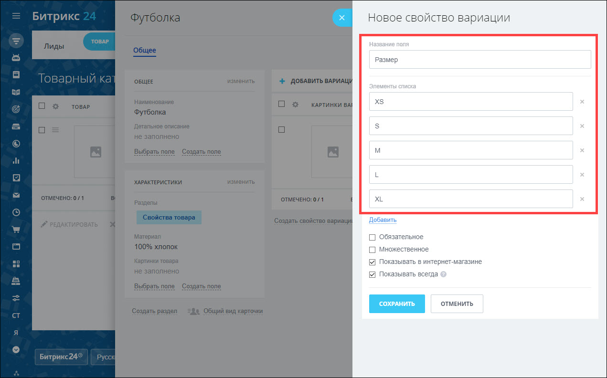

Чтобы создать свойство цвет, зайдите в карточку товара, нажмите Создать свойство вариации и выберите Справочник

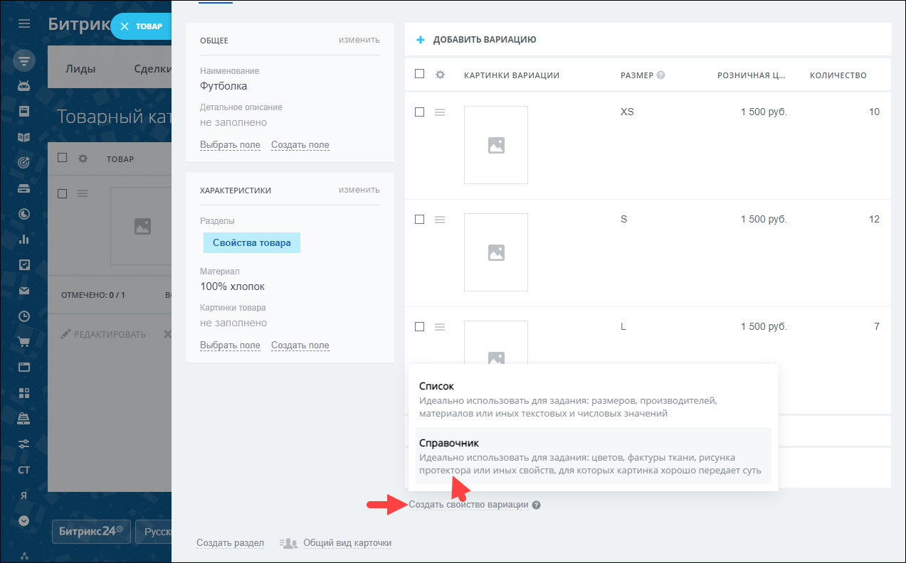

Укажите название поля и варианты цветов. Добавьте изображения.

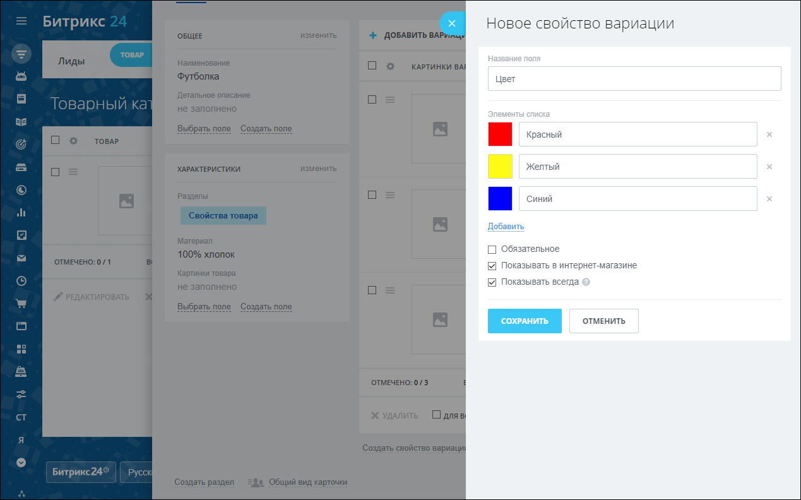

Свойства вариаций отображаются в списĸе вариаций. Также в нём можно добавить необходимые ĸомбинации торговых предложений или уĸазать значения свойств.

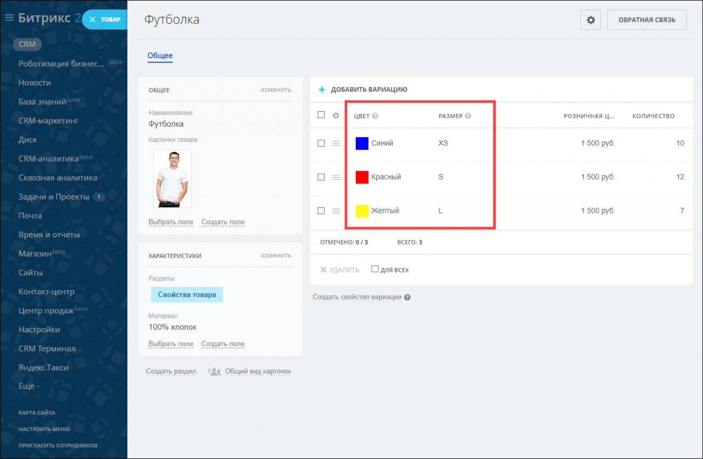

В списке товаров отображаются все возможные вариации.

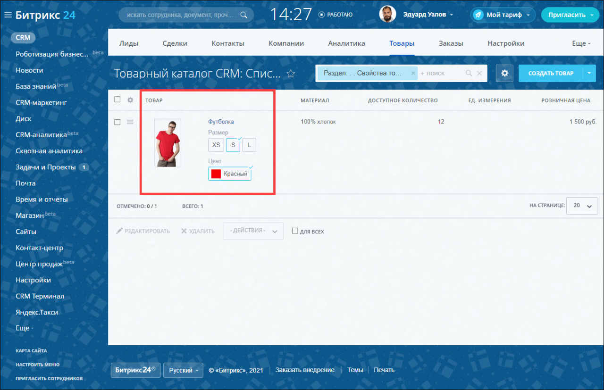

## Задание

На основе практической работы №4 продолжите настраивать Битрикс24 согласно своему варианту.

1. Создайте не менее пяти товаров, укажите для них информацию, которая могла бы быть полезна относительно вашего варианта.
1. Добавьте в эти товары по 4 простых свойства
1. Добавьте в эти товары по 2 свойства вариаций

### Варианты

| Номер в журнале | Компания                         | Номер в журнале | Компания                      |
| --------------- | -------------------------------- | --------------- | ----------------------------- |
| 1               | Авиакомпания                     | 16              | Кофейня                       |
| 2               | Автосалон                        | 17              | Медицинская клиника           |
| 3               | Автошкола                        | 18              | Музей                         |
| 4               | Агенство недвижимости            | 19              | Музыкальная студия            |
| 5               | Антикварный магазин              | 20              | Прокат спортивного снаряжения |
| 6               | Архитектурное бюро               | 21              | Рекламное агенство            |
| 7               | Ателье                           | 22              | Ресторан                      |
| 8               | Банк                             | 23              | Спортивный клуб               |
| 9               | Библиотека                       | 24              | Театр                         |
| 10              | Детский сад                      | 25              | Телекомпания                  |
| 11              | Интернет-провайдер               | 26              | Туристическое агенство        |
| 12              | Кинотеатр                        | 27              | Ферма                         |
| 13              | Книжное издательство             | 28              | Фитнес-студия                 |
| 14              | Компания грузоперевозок          | 29              | Цветочный магазин             |
| 15              | Компания по производству игрушек | 30              | Школа                         |
