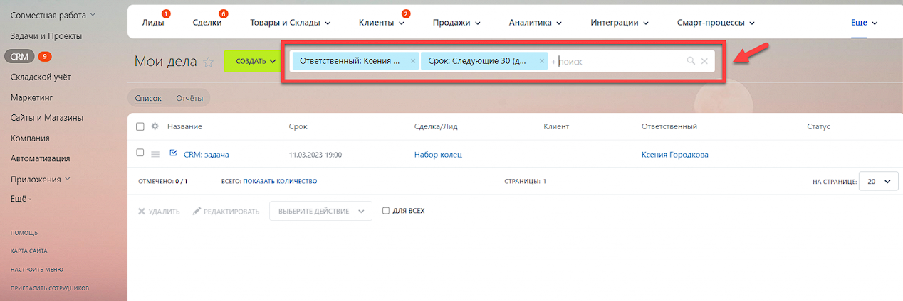
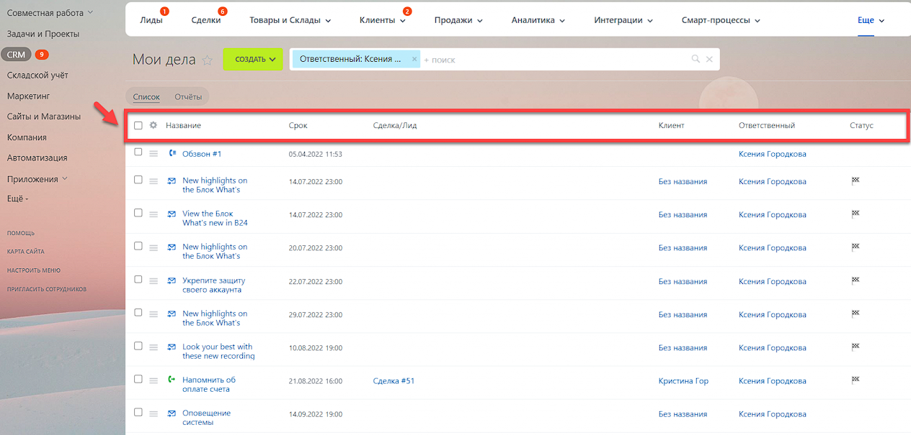

# Практическая работа №4

## Справочная информация

### Дела

Чтобы быть в курсе, чем заняты сотрудники сегодня и какие дела запланированы на неделю, можно воспользоваться разделом Мои дела. Также вы можете составить разные отчёты: нагрузка по коннекторам, общая нагрузка по звонкам и сообщениям и другие.

На странице CRM > Еще > Мои дела находится список запланированных и выполненных дел.

Создать дело вы можете в элементе или на странице Мои дела, нажмите Создать и выберите тип дела.

В верхней части страницы расположена строка поиска. Например, вы быстро можете найти дела на следующий месяц.

При наличии прав вы также можете просмотреть дела других сотрудников. Для этого выберите пользователя в поле фильтра Ответственный.

Список содержит основную информацию о деле: его название, срок, имя клиента, имя ответственного за дело, а также текущий статус.

Чтобы посмотреть подробности о деле, нажмите на него. В слайдере будет подробная информация.

При необходимости вы можете переключиться в режим отчётов. В битрикс есть целый список готовых отчётов с подробной информацией о работе с делами.

#### Действия с делами

С помощью контекстного меню можно выполнить базовые операции: открыть, изменить, отметить как выполненное/невыполненное и удалить дело.

Если нужно отредактировать несколько дел, то отметьте их галочками и выберите нужное действие.

Простые свойства отображаются в левой части карточки товара, а также в списке.

#### Тип дел

- Универсальное дело: Создайте любое дело на основе универсального шаблона.
- Встреча: Назначайте встречи с клиентами, и сохраняйте их в CRM. Встреча также отобразиться в календаре.
- Звонок: Отображаются как входящие, так и исходящие звонки. Причем исходящий звонок можно запланировать и заранее получить напоминание.
- Задача: Создайте задачу прямо из раздела Мои дела, она будет с префиксом **CRM:**.
- Письмо: В списке дел показаны как входящие, так и исходящие письма.
- Обзвон: Создайте список клиентов и запланируйте обзвон.
- SMS-сообщение: В списке дел будут отображены исходящие SMS-сообщения.
- Сообщение (ЕЦУ): Сообщения относятся к функции **Принять оплату**.
- Чат: Чат открытой линии, входящий и исходящий. Чтобы посмотреть подробности, а также открыть чат, нажмите на дело.
- CRM-форма: В списке отображается заполненная CRM-форма. Нажмите на название формы и откроется слайдер с подробностями.
- Сообщение ЖЛ, комментарий к сообщению ЖЛ: Здесь можно увидеть сообщения и комментарии к сообщениям из Живой ленты CRM.
- Задание: Задание бизнес-процесса.
- Дело приложения: Дело, которое было поставлено через приложение из Маркета.
- Визит: Аудио-записи личных встреч с клиентами.

## Задание

На основе практической работы №5 продолжите настраивать Битрикс24 согласно своему варианту.

1. Создайте не менее пяти дел разных типов, укажите для них информацию, которая могла бы быть полезна относительно вашего варианта.
2. Сформируйте отчет по созданным делам

### Варианты

| Номер в журнале | Компания                         | Номер в журнале | Компания                      |
| --------------- | -------------------------------- | --------------- | ----------------------------- |
| 1               | Авиакомпания                     | 16              | Кофейня                       |
| 2               | Автосалон                        | 17              | Медицинская клиника           |
| 3               | Автошкола                        | 18              | Музей                         |
| 4               | Агенство недвижимости            | 19              | Музыкальная студия            |
| 5               | Антикварный магазин              | 20              | Прокат спортивного снаряжения |
| 6               | Архитектурное бюро               | 21              | Рекламное агенство            |
| 7               | Ателье                           | 22              | Ресторан                      |
| 8               | Банк                             | 23              | Спортивный клуб               |
| 9               | Библиотека                       | 24              | Театр                         |
| 10              | Детский сад                      | 25              | Телекомпания                  |
| 11              | Интернет-провайдер               | 26              | Туристическое агенство        |
| 12              | Кинотеатр                        | 27              | Ферма                         |
| 13              | Книжное издательство             | 28              | Фитнес-студия                 |
| 14              | Компания грузоперевозок          | 29              | Цветочный магазин             |
| 15              | Компания по производству игрушек | 30              | Школа                         |
