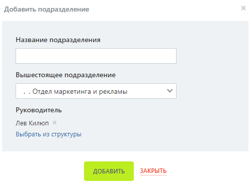

# Практическая работа №4

## Справочная информация

### Сделка

Сделка - это процесс продажи товара или услуги клиенту.
Сделки находятся в разделе CRM - Сделки. Для них доступны два варианта отображения: Список и Канбан. Список удобнее для поиска информации, например, сделок определённого сотрудника, а канбан для оценки ситуации с продажами.

### Особенности сделок

У сделки, как элемента CRM, есть карточка, в которой находится вся информация, связанная с процессом продажи: товары или услуги, сумма, данные клиента. Карточку сделки можно подстроить под любой вид деятельности: создать нужные поля и настроить к ним доступ, объединить поля в блоки и установить нужный вид карточки сотрудникам.

## Задание

Настройка CRM должна соответствовать тематике вашего варианта.  
Каждый пункт должен сопровождаться скриншотом.

1. Зарегистрируйтесь и получите доступ к Битрикс24.
1. Настройте структуру компании. Дерево, описывающее структуру, должно быть размером не меньше 12, высотой не меньше 3.
1. Заполните каждое подразделение как минимум 1 сотрудником.
1. Добавьте как минимум по 3 поля в справочники "Тип сделки", "Обращения", "Тип события"
1. Создайте как минимум 2 категории товаров и услуг, в каждую из которых добавьте не меньше трёх товаров или услуг.

### Варианты

| Номер в журнале | Компания                         | Номер в журнале | Компания                      |
| --------------- | -------------------------------- | --------------- | ----------------------------- |
| 1               | Авиакомпания                     | 16              | Кофейня                       |
| 2               | Автосалон                        | 17              | Медицинская клиника           |
| 3               | Автошкола                        | 18              | Музей                         |
| 4               | Агенство недвижимости            | 19              | Музыкальная студия            |
| 5               | Антикварный магазин              | 20              | Прокат спортивного снаряжения |
| 6               | Архитектурное бюро               | 21              | Рекламное агенство            |
| 7               | Ателье                           | 22              | Ресторан                      |
| 8               | Банк                             | 23              | Спортивный клуб               |
| 9               | Библиотека                       | 24              | Театр                         |
| 10              | Детский сад                      | 25              | Телекомпания                  |
| 11              | Интернет-провайдер               | 26              | Туристическое агенство        |
| 12              | Кинотеатр                        | 27              | Ферма                         |
| 13              | Книжное издательство             | 28              | Фитнес-студия                 |
| 14              | Компания грузоперевозок          | 29              | Цветочный магазин             |
| 15              | Компания по производству игрушек | 30              | Школа                         |
